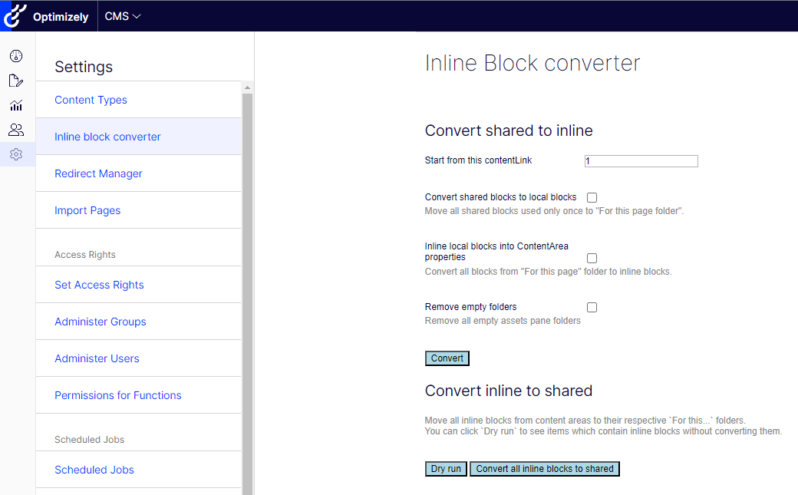

# Episerver Labs - Block Enhancements
This projects contains a migration tool which lets an admin to convert blocks from one format to the other.

The top section allows an admin to run the conversion from shared to inline.
It can be run independently, one by one. First we need to convert shared blocks to local - so 
to move blocks from the Assets pane hierarchy to respective `For this page/block' folders.
Then once we are sure that each block is only used once we can make it inline.

There is also a separate option to clean up empty folders from the hierarchy.

Another feature is the conversion from inline to shared. If inline blocks exist in the
system it might be hard to find them since they do not have an ID of their own.
This migration tool makes it possible to convert them to regular blocks with contentLink 
and place them in respective `For this page/block` folders. It is also possible to place
all newly created blocks in a specific folder named as `"Converted Local Blocks " + DateTime.Now.ToString("u")`
and placed under the assets root `For all sites`.

### Please note
> Episerver Labs projects are meant to provide the developer community with pre-release features with the purpose of showcasing ongoing work and getting feedback in early stages of development.
>
> You should be aware that Labs are trials and not supported Episerver releases. While we hope you use them, there are a few things you should expect from each release:
> - Functionality may be added, removed, or changed.
> - Labs projects have not been through the same quality assurance process as the versioned products and, in some cases, may show unexpected behavior.
>   - The Episerver CMS UI team notes that:
>     - the scenarios in the Readme of each CMS Lab's repo will be verified and supported us
>     - the Labs add-on may or may not work with other add-ons, we are not testing them
>     - any such issues found, such as scenarios outside of the the Readme, can be fixed by the community by submitting a Pull Request on the Github repo
> - The software may not work on all environments.
>   - The Episerver CMS UI team notes that:
>     - Although it should work on base installations of CMS UI in Chrome and Firefox
> - There is no Episerver support; however, we will gratefully receive all feedback
>   - The Episerver CMS UI team notes that:
>     - Issues created on GitHub will be triaged, and if accepted, fixed by us
>
> The software is provided “As is” without warranty of any kind or promise of support. In no event shall Episerver be liable for any claim, damages or liability in relation to the software. By using this software you are also agreeing to our developer program terms [https://www.episerver.com/legal/program-terms/](https://www.episerver.com/legal/program-terms/)
